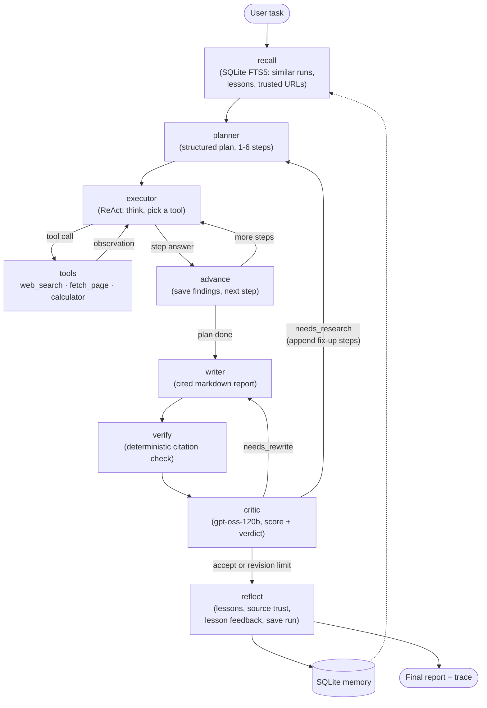

# Self-Improving Research Agent

A research agent that plans, searches, reads pages, calculates, writes a cited report, checks its own citations, has
the report reviewed by a critic, and **learns from every run**. Lessons and trusted sources are stored in SQLite and
used when it plans the next similar task.

**Live demo:** https://asad-research-agent.streamlit.app/ (see [Replay mode](#try-it-without-api-keys) if the free-tier
quota for the day is used up)

Entry for the Techvruk *AI Agentic System Challenge* (2026).

---

## Contents
- [Problem](#problem)
- [Why "self-improving"](#why-self-improving)
- [Architecture](#architecture)
- [Agentic patterns used](#agentic-patterns-used)
- [Results: self-improvement](#results-self-improvement)
- [Results: critic test cases](#results-critic-test-cases)
- [Sample input and output](#sample-input-and-output)
- [Setup and run](#setup-and-run)
- [Project layout](#project-layout)
- [Limitations](#limitations)
- [Disclosure](#disclosure)

---

## Problem

**Task chosen: Research Agent.** Given a topic or question, search the web, read the relevant pages, and compile a
short report with numbered citations.

The hard part of research is not writing the report, it is getting the facts right. Early versions of this agent made
the mistakes that make LLM research reports untrustworthy:

- a price copied from a third-party blog when the task asked for the official page
- arithmetic done "in the head" (10 × $0.33 written as **$3.33**)
- a figure cited to a source that does not contain it
- units mixed up ("$0.095 per 1M dimensions" shown as "per GB-month")
- two sources that contradict each other, both reported as fact

So the agent is built around **checking its own work and remembering what went wrong**, not only around producing text.

## Why "self-improving"

Each run ends with a **reflect** step that writes to a SQLite memory:

1. **Lessons**: short rules derived from what the critic and the citation check found (for example *"When a task
   requires a vendor's official pricing page, fetch that page first ..."*). Near-duplicates only raise a counter.
2. **Trusted sources**: URL-level trust from the deterministic citation check (how many facts were verified or failed
   on that URL, and which facts).
3. **Feedback on memory itself**: lessons that were recalled are marked *used*; if the run was accepted with no
   revision they are marked *helpful*.

The next run on a similar task starts with a **recall** step (full-text search, no LLM call) that puts those lessons
and trusted URLs into the planner, executor and writer prompts. If a trusted URL matches the task, the executor
fetches it directly and focuses on the facts verified there before.

The effect is measurable: on the same model and setup, the first critique went from **3/10 to 9/10**, revisions from
**1 to 0**, and tokens from **28,411 to 13,604**. See [Results](#results-self-improvement).

## Architecture



Built with **LangGraph**: every node reads and writes one shared `AgentState` (task, plan, step results, sources,
tool log, draft, critique, revision count, memory). The graph is in [agent/graph.py](agent/graph.py).

| Node | What it does | LLM? |
|---|---|---|
| **recall** | Finds similar past tasks (FTS5, ≥ 2 shared content terms), the top 5 lessons and the trusted URLs from those runs | no |
| **planner** | Breaks the task into steps, each with a goal and a search query. On `needs_research` it appends *fix-up* steps from the critic's findings | yes |
| **executor** | ReAct loop per step: reasons, calls a tool, reads the observation, repeats (max 4 calls per step), then writes the step's findings with citations. Gets the findings of earlier steps as context. Blocks duplicate tool calls within a step | yes |
| **tools** | `web_search` (Tavily, DuckDuckGo fallback), `fetch_page` (Tavily Extract renders JavaScript; httpx + trafilatura fallback; returns the passages that best match a `focus`), `calculator` (safe expression evaluator). Tool errors become observations, never crashes | no |
| **advance** | Marks the step done and moves to the next one, or on to the writer | no |
| **writer** | Writes the report from the step findings, with sequential `[n]` citations and a Sources list | yes |
| **verify** | For every number in the report, checks that it appears in the cited source (or elsewhere, and names where), or matches a calculator result. Also flags unit mismatches | no |
| **critic** | Always the strongest model (gpt-oss-120b). Scores 0-10 and returns issues, missing info, **constraint violations** (e.g. "the task said official page") and a verdict | yes |
| **routing** | `accept` → reflect. `needs_rewrite` → writer again. `needs_research` → planner adds fix-up steps. At most 2 revisions | no |
| **reflect** | Updates source trust, asks for 1-3 lessons when the run had problems, marks recalled lessons used/helpful, saves the run and the report | yes (only when there were problems) |

Every run is streamed as events (`agent/runner.py`) to the CLI or the UI, and recorded as a JSONL trace that the UI can
replay.

### Reliability on free-tier APIs
- **Model fallback chain** per role: gpt-oss-20b → gpt-oss-120b → qwen3.8-27b (three separate Groq quota pools) →
  NVIDIA NIM → Gemini 2.5 Flash.
- **Rate-limit handling**: short 429s (per-minute limits) are waited out using the provider's retry time; long ones
  (daily quota) move to the next model at once.
- **Graceful stop**: if every provider fails, the run stops with a *partial report* (finished steps + sources) instead
  of crashing, and the trace is kept.
- **Public demo cap**: at most 15 live runs per UTC day from the UI; Replay mode always works.

## Agentic patterns used

| Pattern | Where |
|---|---|
| **Plan-and-Execute** | `planner` produces the step list; `executor` + `advance` work through it in order, with earlier findings as context |
| **ReAct** | `executor` ⇄ `tools`: thought → tool call → observation → next thought, per step |
| **Tool use** | Web search, page fetch with focused extraction, calculator; the model chooses tools by function calling |
| **Reflection / critic loop** | Deterministic `verify` + LLM `critic`; conditional routing to rewrite or re-research, bounded at 2 revisions |
| **Long-term memory** | SQLite + FTS5: runs, lessons (with seen/used/helpful counters), URL-level source trust with verified facts |
| **Workflow orchestration** | LangGraph state graph with conditional edges (executor → tools/advance, advance → executor/writer, critic → writer/planner/reflect) |

## Results: self-improvement

**Controlled comparison.** Four runs in a row on the same kind of task, all with the **same model**
(`qwen/qwen3.8-27b` for every role, critic on `gpt-oss-120b`), a **fresh memory database**, **fallbacks off**
(`LLM_FALLBACKS=false`, so no run could silently switch to a different model) and the token saver on. Run #1 and run
#4 are the before/after pair: the same kind of question (10 GB vs. 25 GB), with nothing but the memory changed in
between. Code fixes to how memory is used were made between runs (listed below the table); the models and settings
were not changed.

| Run | Task | Memory recalled | First critique | Final | Revisions | Tokens |
|---|---|---|---|---|---|---|
| **#1 before** | 10 GB | none | **3/10** needs_research (third-party "$3.33"; official page not used) | 9/10 accept | **1** | **28,411** |
| #2 | 25 GB | 2 lessons + trusted URL | 6/10 needs_rewrite (derived "$41.75" cited to the page) | 9/10 accept | 1 | 18,223 |
| #3 | 40 GB | 3 lessons + trusted URL | 4/10 (focused fetch missed $0.33, fell back to a third-party site) | 8/10 (revision limit) | 1 | 38,509 |
| **#4 after** | 25 GB | 4 lessons + trusted URL | **9/10 accept** | 9/10 accept | **0** | **13,604 (−52%)** |

Fixes between runs: lessons were also given to the writer (after #2); a fetch of a trusted URL now includes that
page's verified facts in its focus, digits weigh 3×, and passages are picked by greedy term coverage (after #3).

All four runs are in [samples/traces/](samples/traces/) and can be replayed in the UI step by step. Run #3 is included
on purpose: memory did not help on that run, and it is what led to the focus fix.

## Results: critic test cases

[scripts/critic_eval.py](scripts/critic_eval.py) feeds the `verify` and `critic` nodes fixed drafts that reproduce each
real failure seen during development, plus a clean control. **6/6 as expected** (Sep 26, 2026).

| Case | Caught by | Result |
|---|---|---|
| 1. Unit error: Weaviate "$0.095 per 1M dimensions" shown as "/ GB-month" | deterministic `unit_mismatch` + critic | ✅ needs_rewrite |
| 2a. Contradiction: Qdrant "$25 minimum" vs. "no minimum" | critic | ✅ needs_rewrite |
| 2b. Contradiction: Pinecone reads "$16/M" vs. "$0.00000025/RU" (= $0.25/M) | critic (converted the units itself) | ✅ needs_rewrite |
| 3. Misattributed citation: $0.33 cited to a source that lacks it | deterministic `not_in_source` (also names where it really is) + critic | ✅ flagged |
| 4. Task says "official pricing page" but it was never fetched | critic `constraint_violations` → fix-up step "fetch_page https://www.pinecone.io/pricing/ ..." | ✅ needs_research |
| 4b. Calculator result $3.30 must not be flagged | deterministic `calculated` | ✅ not flagged |
| Control: clean, consistent report | critic | ✅ accept (8/10) |

The unit tests (`pytest tests`, 81 tests, no API calls) cover the citation check, critic routing, executor, tools,
memory, resilience, the usage cap and the Streamlit app (via `AppTest` on recorded traces).

## Sample input and output

**Input:**
```
Using Pinecone's official pricing page, what would 25 GB of storage cost per month on the Standard plan?
```

**Output** (run #4, excerpt; the full report is in [samples/outputs/02-after-memory-pinecone-25gb.md](samples/outputs/02-after-memory-pinecone-25gb.md)):

> Based on Pinecone's official pricing page, 25 GB of storage on the Standard plan costs **$50 per month** [1]. While
> the raw storage cost for 25 GB is $8.25, the Standard plan enforces a $50/month minimum usage charge [1].
>
> | Component | Value | Calculation / Rule | Source |
> |---|---|---|---|
> | Per-GB storage rate | $0.33/GB/mo | Listed on official pricing page | [1] |
> | Minimum monthly charge | $50/month | Listed on official pricing page | [1] |
> | Raw storage cost (25 GB) | $8.25/mo | 25 GB × $0.33/GB/mo | [1] |
> | **Final monthly cost** | **$50/month** | max($8.25, $50) | [1] |
>
> 1. [pinecone.io/pricing](https://www.pinecone.io/pricing)

Along with the report, the run shows (CLI or UI): the plan, every thought / tool call / observation, the citation
check (`4 cited numbers - 1 calculated, 3 verified`), the critique (9/10 accept), the lessons used, and tokens per model.

More samples, including the rejected first draft of run #1 and what the critic said about it:
[samples/README.md](samples/README.md).

## Setup and run

Requires Python 3.11+ and free API keys for **Groq** (required) and **Tavily** (recommended; DuckDuckGo is used
without it). NVIDIA NIM and Gemini keys are optional fallbacks.

```bash
git clone https://github.com/shaikasadahmed2k23/self-improving-research-agent_Submission.git
cd self-improving-research-agent_Submission
python -m venv .venv
# Windows: .venv\Scripts\activate    macOS/Linux: source .venv/bin/activate
pip install -r requirements.txt
cp .env.example .env          # then fill in GROQ_API_KEY and TAVILY_API_KEY
python scripts/check_setup.py # checks each key with a tiny request
```

### Command line
```bash
python cli.py "Compare the pricing of the top 3 managed vector databases" --out reports/vector-dbs.md
python cli.py --dev 2                 # short preset task (1-4); use with TOKEN_SAVER=true in .env
python cli.py --dev 4 --no-memory     # skip recall and reflect (for with/without-memory comparisons)
python scripts/show_memory.py         # runs, lessons and trusted sources in the memory DB
```
The CLI prints each event as it happens (`PLAN`, `THINK`, `ACT`, `OBSERVE`, `VERIFY`, `CRITIQUE`, `LEARN`), then the
report, the critic score, tools used and tokens per model. Reports are saved in `reports/`, traces in `data/traces/`.

### Web UI
```bash
python -m streamlit run app.py
```
- **Research tab, Live run**: pick an example task or write one, press **Run research**. The plan checklist (with
  *fix-up* steps marked), the live trace, the critic score and the report (with a download button) appear as the
  agent works.
- **Research tab, Replay a recorded run**: plays a saved trace step by step. **No API calls.**
- **Memory tab**: critic score, revisions and tokens per run (charts), lessons with their seen/used/helpful counts,
  trusted sources, run history.
- Sidebar: memory on/off, choice of memory database, and which models are active.

### Try it without API keys
Open the [live demo](https://asad-research-agent.streamlit.app/) (or run the UI locally), set **Mode → Replay a
recorded run**, choose `m4-qwen-run1-before-10gb` and then `m4-qwen-run4-after-25gb`, and press **Replay**.

### Useful settings (`.env`)
| Setting | Default | Meaning |
|---|---|---|
| `GROQ_MODEL` / `GROQ_MODEL_STRONG` | gpt-oss-20b / gpt-oss-120b | Default model / critic model |
| `USE_STRONG_MODEL` | false | Planner and writer also use the 120B model |
| `TOKEN_SAVER` | false | Caps for cheap runs: 3 steps, 3 LLM calls/step, 1 revision, shorter page views |
| `LLM_FALLBACKS` | true | false = never switch models (for fair comparisons) |
| `MEMORY_DB_PATH` | data/agent_memory.db | Point at another file to keep experiments apart |
| `DAILY_RUN_CAP` | 15 | UI live runs per UTC day (0 = no limit) |

### Tests
```bash
python -m pytest tests -q            # 81 tests, no API calls
python scripts/critic_eval.py        # critic on the fixed failure cases (uses about 40k gpt-oss-120b tokens)
```

## Project layout
```
agent/
  graph.py            LangGraph wiring (nodes + conditional edges)
  state.py            shared AgentState
  runner.py           stream_run(): single entry point for CLI and UI, records traces, graceful stop
  llm.py              model factory, fallback chain, rate-limit retry, structured output per provider
  verification.py     deterministic citation / unit / calculation check
  nodes/              recall, planner, executor, tools_node, advance, writer, verify, critic, reflect
  tools/              search (Tavily + DuckDuckGo), fetch (Tavily Extract + trafilatura), calculator, registry
  memory/             schema.sql (runs, lessons, sources, FTS5) and store.py
  usage.py            daily live-run cap for the public demo
app.py                Streamlit UI (live run, replay, memory tab)
cli.py                command line
scripts/              check_setup, critic_eval, show_memory, log_to_trace, deploy helpers
samples/              sample reports, replayable traces, seed memory
docs/                 slide outline and demo script
tests/                pytest suite
```

## Limitations

- **Free-tier quotas are the main constraint.** Groq allows about 200k tokens per day per model and 8k tokens per
  minute; Gemini 2.5 Flash only 20 requests per day. A narrow task costs about 15-25k tokens, a broad comparison with
  revisions 70-100k, so a broad task can use up a model's daily quota. The fallback chain helps, but a fallback changes
  the model mid-run (which is why `LLM_FALLBACKS=false` exists for fair comparisons).
- **Smaller models use tools less.** gpt-oss-20b rarely fetches pages or uses the calculator unless the task asks for
  it; gpt-oss-120b does so readily. Memory and the directed fetch close part of this gap.
- **The self-improvement evidence is small**: one task family (Pinecone pricing), four runs, one model setup. It shows
  the mechanism working, not a general benchmark. Run #3 shows it can still fail.
- **Recall is lexical** (FTS5 with ≥ 2 shared terms), not semantic, so a differently worded but related task may not
  find the lessons.
- **Lesson categories from reflection are unreliable**, so the writer gets all recalled lessons rather than a filtered
  set.
- **The public demo shares one memory** between all visitors, and Streamlit Community Cloud's disk is ephemeral:
  memory and the daily run count reset when the app restarts (the seed memory is restored).
- Pages that need a login, or that Tavily Extract cannot render, are read only partially.
- The planner sometimes writes "as of 2024-2025" although today's date is in its prompt.

## Disclosure

- **AI assistance:** this project was built with **Claude Code** (Anthropic) as a coding assistant. The problem choice,
  architecture, workflow design, and evaluation were directed by the author; the assistant helped write and debug code
  and documentation.
- **APIs:** all APIs are used on their **free tiers**: Groq (gpt-oss-20b, gpt-oss-120b, qwen3.8-27b), Google Gemini
  (gemini-2.5-flash), Tavily (search and extract), plus NVIDIA NIM (free developer access) as an optional fallback and
  DuckDuckGo search (no key). No paid APIs are used.
- **Hosting:** Streamlit Community Cloud (free).
